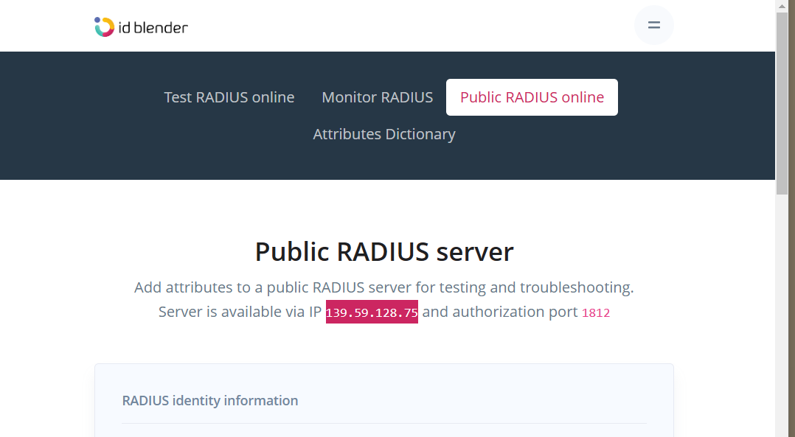

# Wireshark-for-Basic-Network-Security-Analysis
This is a course conducted by coursera.

# Genrate and Capture Radius Traffic
In this segment, it will show how to capture on a port. By using the **Public Radius Server**, this task shows how to capture the authentication request and how to check encrypt and decrypt data. 
In this website, https://idblender.com/tools/public-radius, first set a username and password for checking how to do authenctication using wireshark. 
